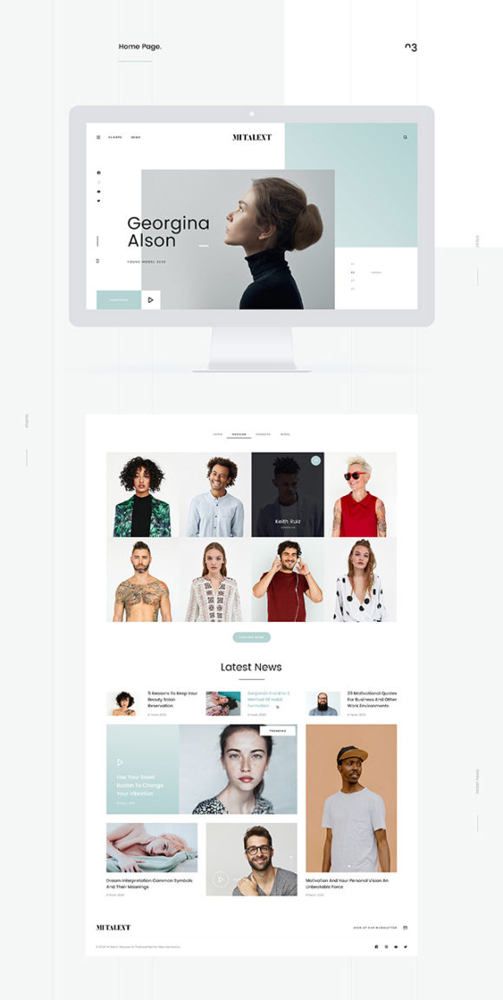

# A minimalist portfolio website

We are going to build the above design in ReactJs and VanillaCSS. I might include TailwindCSS if the classNames begin to conflict or naming sections becomes hard.

## How to run

1. Clone the repository using `git clone https://github.com/SankThomas/minimalist-portfolio.git` or download and extract the zip file.
2. Open up the cloned folder in your preferred text editor. Open up a terminal within your workspace and navigate into the `tutorial` folder by saying `cd tutorial`
3. Within the tutorail folder, run `npm install` which will install all dependencies for you after which you can run `npm start` and you should get the default react-app running on `http://localhost:3000`

### If you're having trouble

If you're having trouble getting around the project structure, I will be releasing a YouTube video which you can follow. I will post the link when the video is uploaded.
